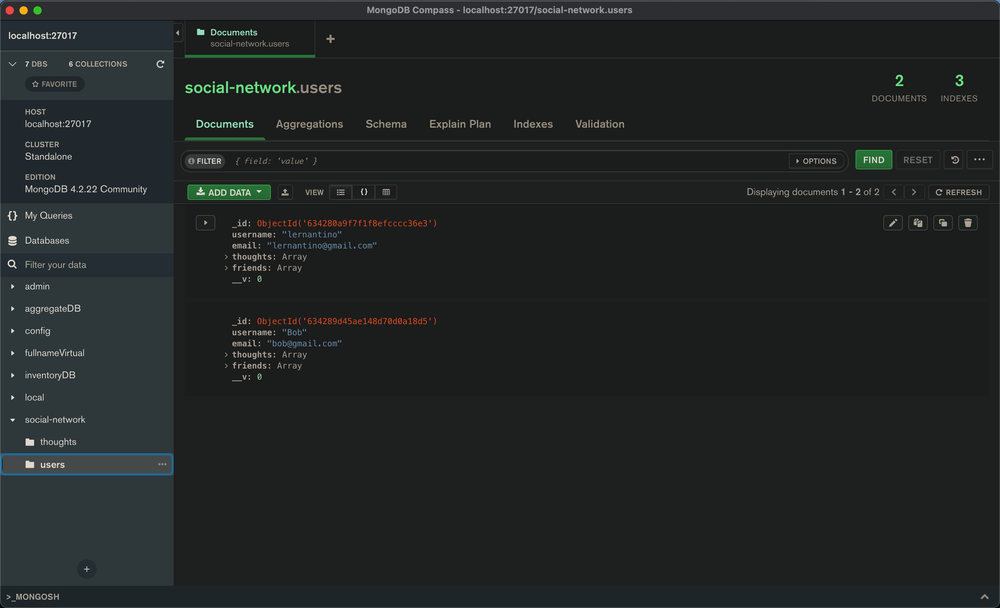
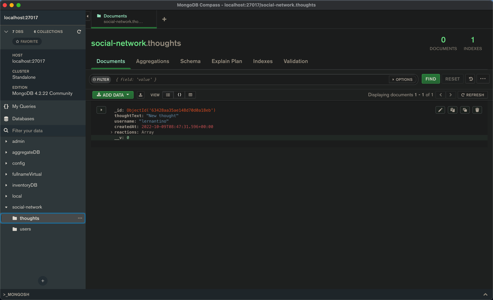

# 18 NoSQL: Social Network API

## Description 

MongoDB is a popular choice for many social networks due to its speed with large amounts of data and flexibility with unstructured data.

We were tasked to build an API for a social network web application where users can share their thoughts, react to friends’ thoughts, and create a friend list. It was required we use; Express.js for routing, a MongoDB database, and the Mongoose ODM. 

It was mandatory that the application consisted of the following routes; 

```
/api/users
- GET all users
- GET a single user by its `_id` and populated thought and friend data
- POST a new user
- PUT to update a user by its `_id`
- DELETE to remove user by its `_id`

/api/users/:userId/friends/:friendId
- POST to add a new friend to a user's friend list
- DELETE to remove a friend from a user's friend list

/api/thoughts
-GET to get all thoughts
-GET to get a single thought by its _id
-POST to create a new thought (don't forget to push the created thought's _id to the associated user's thoughts array field)
-PUT to update a thought by its _id
-DELETE to remove a thought by its _id

/api/thoughts/:thoughtId/reactions
-POST to create a reaction stored in a single thought's reactions array field
-DELETE to pull and remove a reaction by the reaction's reactionId value

```
To view demonstrations please refer to usage section. 


## Table of Contents 
- [Installation](#installation)
- [Usage](#usage)
- [Features](#features)

## Installation

Assuming the user has Insomnia and MongoDBCOmpass installed on their computer. If both of these are not installed on your computer you must install them to successfully use this application.

To use the application, the user must clone the repo from Github. 

Once the user has cloned the repo, it is important to make sure that all the necessary dependencies have been installed. 

This can easily be achieved by opening the command terminal and inputting 'npm i'; this will automatically install all dependencies and packages for the application to successfully run. 

Once everything is installed it is time to connect to the server, this is done by inputting node server.js into the command line. 

A message will appear in the command terminal; ************** Connected on localhost:3001 ************* <br>
If this message is present you have successfully connected to Insomnia and can begin to use the application. 


## Usage

To view a video demonstrations of how to use the application please click here 

[To view the user demo plese click here](https://drive.google.com/file/d/1R4HCIxJeTMtqoY8R4tDfzTzocNb6IDQB/view)


To view the database that is created in MongoDBCompass; you will be looking for a database called 'social-network'

The database is made up of 2 sections 'thoughts' and 'users'. 
When viewing the 'users' you can see a users _id, username, email, thoughts and friends. 



When viewing the 'thoughts' you can see thought id, thoughtText(what the user wrote), username, createdAt (time the thought was created) and reactions (if any friends have reponsded to the thought). Reactions are made up of reactionBody (the text someone replied with), the user who reacted and createdAt (time they reacted) 



## Features 
This appplication has the following features used in it
- Express.js
- Moment 
- Mongoose 
- Nodemon
- Insomnia 
- Regex
